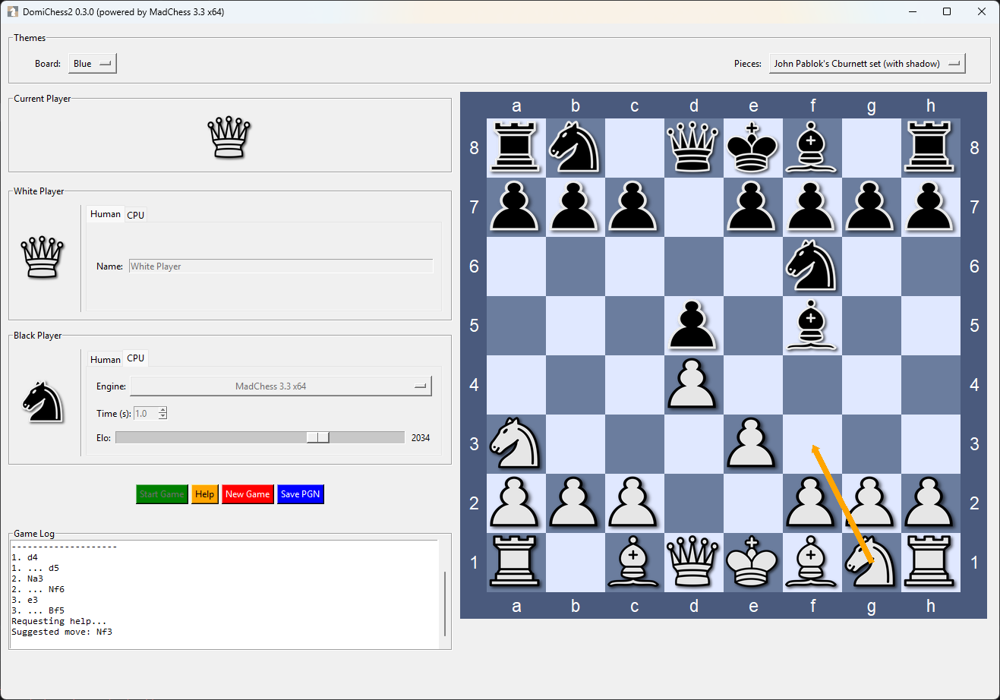

# DomiChess2

Welcome to DomiChess2, a simple and elegant chess application for your desktop. Play against a friend, challenge a computer opponent, and customize the look and feel of your game to your liking.



## Features

- **Play Your Way**: Enjoy games between two human players or challenge a computer opponent (CPU). You can even watch two CPUs battle it out!
- **Save Your Games**: Save your completed games in the standard **PGN (Portable Game Notation)** format. A dialog allows you to add metadata like the event name, site, and round, making your saved games compatible with almost any chess software.
- **Add Your Own Engines**: Easily add any standard (UCI) chess engine. If the engine supports it, you can even adjust its playing strength (Elo) directly from the interface.
- **Total Visual Customization**:
    - Mix and match separate themes for the board and the pieces.
    - Create your own themes using image files (`.png`) or by simply defining colors in a text file.
- **User-Friendly Experience**:
    - A clean, resizable interface.
    - A "Current Player" display to always know whose turn it is.
    - A "Help" button that suggests a move, powered by the strongest available engine.
    - An integrated **Game Log** that shows detected themes and engines at startup, player info, and a complete move history for the current game.

## Getting Started

No installation required! Simply double-click on `DomiChess2.exe` to start the application.

The first time you run the game, it will automatically create two new folders for you: `engines` and `themes`. This is where you can add your own content.

## How to Customize

### Adding New Chess Engines

1.  Open the `engines` folder that was created next to `DomiChess2.exe`.
2.  Create a new folder inside it for your engine (e.g., `MyNewEngine`).
3.  Copy the engine's `.exe` file (and any other files it needs) into this new folder.
4.  Restart DomiChess2. The new engine will automatically appear in the "Engine" dropdown list in the player panels.

### Adding New Themes

Themes are located in the `themes` folder, which is split into `boards` and `pieces`.

#### To Add a New Board Theme:

1.  Go into the `themes/boards` folder.
2.  Create a new folder for your theme (e.g., `my_cool_board`).
3.  Inside, you have two options:
    - **Image-based**: Add two files, `light_square.png` and `dark_square.png`.
    - **Color-based**: Create a text file named `colors.json` and define the colors like this:
      ```json
      {
          "light": "#D3D3D3",
          "dark": "#A9A9A9",
          "border": "#808080",
          "coordinates": "white"
      }
      ```
4.  (Optional) Add a `name.txt` file containing the name you want to see in the dropdown menu.

#### To Add a New Piece Set:

1.  Go into the `themes/pieces` folder.
2.  Create a new folder for your piece set (e.g., `my_cool_pieces`).
3.  Place your transparent `.png` files inside, named exactly as follows:
    - **White Pieces**: `wK.png` (King), `wQ.png` (Queen), `wR.png` (Rook), `wB.png` (Bishop), `wN.png` (Knight), `wP.png` (Pawn).
    - **Black Pieces**: `bK.png`, `bQ.png`, `bR.png`, `bB.png`, `bN.png`, `bP.png`.
4.  (Optional) Add a `name.txt` file for a custom display name.

## Acknowledgments

- Special thanks to **Erik Madsen** for his incredible work on the [MadChess](https://www.madchess.net/) engine, which is used as the default engine for the "Help" feature in this application.
- The beautiful "Cburnett" piece set was created by **John Pablok**, available on [OpenGameArt.org](https://opengameart.org/content/chess-pieces-and-board-squares).
- This project is powered by the powerful and elegant [python-chess](https://github.com/niklasf/python-chess) library by **Niklas Fiekas**.
- The executable version is made possible by the hard work of the [PyInstaller team](https://www.pyinstaller.org/).
- The development workflow is greatly accelerated by the blazingly fast [uv tool](https://github.com/astral-sh/uv) from Astral.
- Development was made pleasant and efficient thanks to the [PyCharm IDE](https://www.jetbrains.com/pycharm/) by JetBrains.
- This project follows the [Semantic Versioning](https://semver.org/) specifications for clear and predictable versioning.
- Thanks to [choosealicense.com](https://choosealicense.com/) for providing clear guidance on open-source licenses.
- A huge thank you to the **Google DeepMind team**; this entire development process was made possible by their Gemini model, with the developer acting as a humble pilot.

## License

This project is licensed under the MIT License. See the [LICENSE.md](LICENSE.md) file for details.
